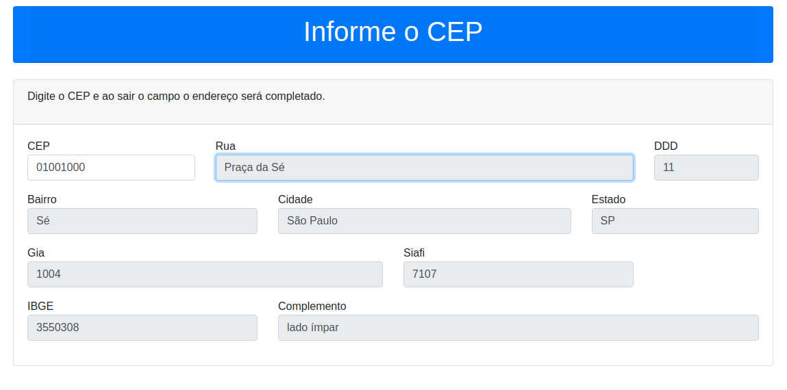

# Pesquisa Cep

### [link para o projeto]( https://pesquisa-cep.netlify.app/)

Simples projeto para testar requisição __AJAX__ , utilizando o  metodo __fetch()__ , consumindo a __API__ do __Via Cep Brasil__


Através do formulário é possivel obter os dados de uma localização adicionando apenas o **CEP** , o formualario
possiu um alto-complete desenvolvido com javascript e trata erros como __CEP invalido__

```sh
 let pesquisarCep = (cep) => {
            removeInfoErro();
            fetch(`https://viacep.com.br/ws/${cep}/json/`).then(result => {
                result.json().then(res => {
                    if (res.erro) {
                        resetForm();
                        notificaErro();
                    } else {
                        document.getElementById('rua').value = res.logradouro;
                        document.getElementById('bairro').value = res.bairro;
                        document.getElementById('cidade').value = res.localidade;
                        document.getElementById('estado').value = res.uf;
                        document.getElementById('ddd').value = res.ddd;
                        document.getElementById('gia').value = res.gia;
                        document.getElementById('siafi').value = res.siafi;
                        document.getElementById('ibge').value = res.ibge;
                        document.getElementById('complemento').value = res.complemento;
                    }
                })
            }).catch(err => {
                resetForm();
                notificaErro();
            })
        }
```

